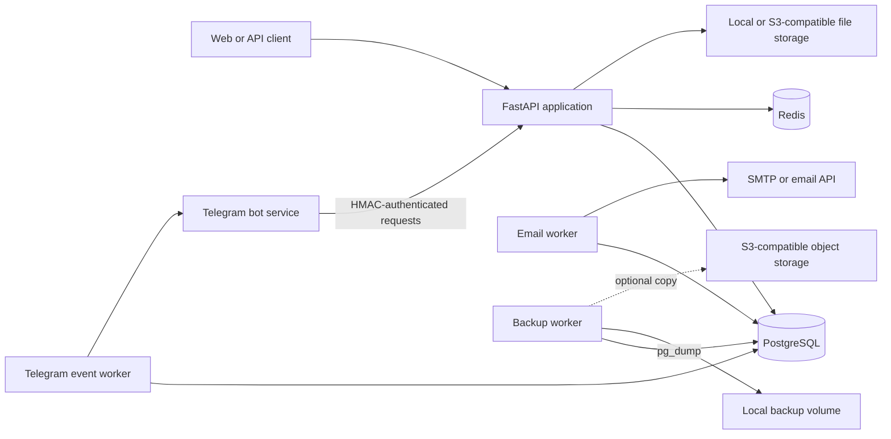

# Student Knowledge Hub

[](https://github.com/ShodmonX/student-knowledge-hub/actions/workflows/ci.yml)
[](https://codecov.io/gh/ShodmonX/student-knowledge-hub)

An engineering-focused backend for organizing, reviewing, and sharing university learning materials. The repository highlights PostgreSQL data design, asynchronous Python services, Redis-backed security controls, background workers, containerized deployment, and logical database backup workflows.

## Overview

Student Knowledge Hub provides APIs for university catalogs, users, learning materials, moderation, community interactions, notifications, and Telegram integration. FastAPI handles the HTTP layer, PostgreSQL is the primary datastore, and dedicated workers process email and Telegram outbox records outside request handling.

The project is positioned as a backend and database-engineering portfolio project. It does not claim PostgreSQL physical backup, WAL archiving, point-in-time recovery, or automated disaster recovery.

## Architecture



## Key Engineering Features

- FastAPI APIs organized by domain modules.
- PostgreSQL access through SQLAlchemy's async engine and `asyncpg`.
- Alembic-managed schema with a consolidated initial migration.
- Configurable connection pooling, pre-ping, recycling, pool timeout, and PostgreSQL statement timeout.
- Redis-backed caching, request rate limits, login lockout state, and access-token revocation.
- JWT access and refresh tokens, Argon2 password hashing, refresh-token rotation, and reuse detection.
- Database-backed email and Telegram event outboxes with worker retry limits.
- Local filesystem or S3-compatible material storage.
- Docker Compose services for the API, PostgreSQL, Redis, and workers.
- Pytest coverage in CI against PostgreSQL 16.
- Application-managed PostgreSQL logical backup and guarded restore workflow.

## PostgreSQL and Data Layer

PostgreSQL is the primary runtime datastore. The application uses SQLAlchemy async sessions with `asyncpg`, while Alembic uses a synchronous `psycopg` URL derived from the application database URL.

Database behavior is configurable through environment variables including:

- `DB_POOL_SIZE`
- `DB_MAX_OVERFLOW`
- `DB_POOL_TIMEOUT`
- `DB_POOL_RECYCLE`
- `DB_POOL_PRE_PING`
- `DB_STATEMENT_TIMEOUT_MS`

The request-scoped session dependency rolls back active transactions when an exception escapes. Tests create and later remove a dedicated PostgreSQL test database; a safety check requires its name to start with `test_` or end with `_test`.

The public repository contains one consolidated initial Alembic schema migration. The migration is intentionally preserved rather than split into artificial history.

## Backup and Restore

The backup service implements an application-managed logical PostgreSQL workflow:

- `pg_dump --format=custom` creates the dump.
- `pg_restore --list` validates the archive when verification is enabled.
- A JSON manifest records the database, creation time, size, trigger, and SHA-256 checksum.
- Local backups are retained by count.
- S3-compatible storage can hold optional offsite copies when the S3 storage backend is configured.
- Restore validates the backup identifier, file extension, path or object prefix, maximum size, archive structure, and checksum.
- The disabled-by-default restore API requires an explicit `RESTORE:<backup_id>` confirmation and creates a pre-restore backup.

The operator script is intended for manual recovery after data loss:

```bash
docker compose -f docker-compose.prod.yml run --rm backup \
  python scripts/manual_restore_backup.py <backup_id> \
  --confirmation RESTORE:<backup_id>
```

This is a logical backup mechanism, not PITR, WAL recovery, a physical backup system, or a complete disaster-recovery platform.

## Security Controls

- Production configuration rejects debug mode and unchanged default JWT/admin credentials.
- Production Redis URLs must include authentication when Redis-backed controls are enabled.
- Sensitive authentication endpoints use rate limiting and login brute-force lockout controls.
- Access tokens can be revoked individually or for all sessions associated with a user.
- Refresh tokens are stored as hashes, rotated on use, and checked for replay.
- Internal Telegram endpoints verify service identity, timestamp freshness, body hash, and HMAC signature.
- S3 configuration is validated when the S3 storage backend is selected.
- API documentation endpoints are disabled when debug mode is off.

Redis connection failure degrades the cache instead of terminating the API. Production deployments should monitor `/health/ready`, because Redis-dependent security state is unavailable while Redis is disconnected.

## Running Locally

Requirements: Docker with Compose and Git.

```bash
cp .env.example .env
docker network create web
docker compose up --build
```

If the `web` network already exists, continue after Docker reports that it already exists.

The API is available at `http://localhost:8000`. Useful health endpoints are:

- `GET /health/live` — process liveness.
- `GET /health/ready` — database, Redis, storage, and backup status.

The development entrypoint applies Alembic migrations and seeds the initial catalog by default. Change local credentials and secrets in `.env`; the example values are not suitable for deployment.

## Testing and CI

Install the project and development tooling:

```bash
python -m venv .venv
python -m pip install -e ".[dev]"
```

Start the test dependencies, then run tests and linting:

```bash
docker network create web
docker compose up -d postgres redis
python -m pytest
python -m pytest --cov=app --cov-report=term-missing
ruff check .
```

GitHub Actions runs on pushes to `main` and pull requests. CI starts PostgreSQL 16, checks the Alembic head, runs the test suite with an 85% coverage threshold, and uploads `coverage.xml` to Codecov through a GitHub secret.

## Production Deployment

`docker-compose.prod.yml` runs the API, Redis, backup scheduler, email worker, and Telegram event worker. PostgreSQL is supplied through `DB_URL`; it is not created by the production Compose file. The API is exposed to the external `web` Docker network without publishing a host port.

Before deployment:

1. Create a private `.env` from `.env.example` and replace every placeholder secret.
2. Configure a reachable PostgreSQL database and authenticated Redis URL.
3. Create the external `web` Docker network used by the reverse proxy.
4. Configure local storage or complete S3-compatible credentials.
5. Validate the rendered Compose configuration.

```bash
docker network create web
docker compose --env-file .env -f docker-compose.prod.yml config
docker compose --env-file .env -f docker-compose.prod.yml up -d --build
```

Production Compose disables automatic seed execution. Run the seed command explicitly only when needed:

```bash
docker compose --env-file .env -f docker-compose.prod.yml run --rm api \
  python scripts/seed_once.py
```

## Repository Structure

```text
app/
  api/              Router composition and internal API wiring
  bootstrap/        Seed, backup, and backup scheduler services
  core/             Configuration, security, cache, email, and logging
  db/               SQLAlchemy setup, models, and Alembic migrations
  infrastructure/   Local and S3-compatible storage providers
  modules/          Domain modules and API endpoints
scripts/            Worker, seed, backup, and restore entry points
tests/              Unit and PostgreSQL-backed integration tests
docker/             Container entrypoint
.github/workflows/  Continuous integration
```

## Engineering Decisions and Trade-offs

- Async database access keeps request handling compatible with I/O-bound API workloads while PostgreSQL remains the source of truth.
- Database outboxes separate external email and Telegram delivery from API transactions, but workers use polling rather than a message broker.
- Redis centralizes short-lived cache and security state; readiness reporting exposes degraded operation when it is unavailable.
- Logical backups are portable and easy to inspect, but they do not provide the recovery-point guarantees of WAL-based PostgreSQL recovery.
- The production Compose file expects externally managed PostgreSQL and reverse-proxy networking, keeping database lifecycle outside the application stack.

## License

Licensed under the [MIT License](LICENSE).
